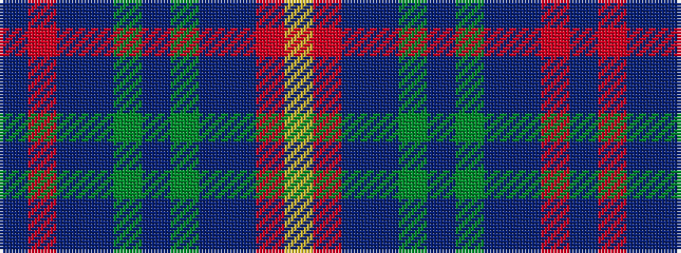

BRBBGBGBBRY

It is a 11 stripe tartan.

<figure class="pat-woven">

<figcaption>idealised sample</figcaption>
</figure>

## Colour Sequence



## Tartans with this colour sequence

| Tartans |
|---------------|
| [McMurchie (Personal)](/variants/s11/t1r13db6dp7g2dp7g2dp7db6r13ly1~x2/)|
||
