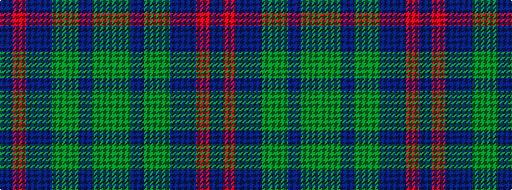

BRBBGGBGG

It is a 9 stripe tartan.

<figure class="pat-woven">

<figcaption>idealised sample</figcaption>
</figure>

## Colour Sequence



## Tartans with this colour sequence

| Tartans |
|---------------|
| [Westbrook (2013)](/variants/s9/dg15y3dr2y3dg8b12db20r2db4~x2/)|
||
