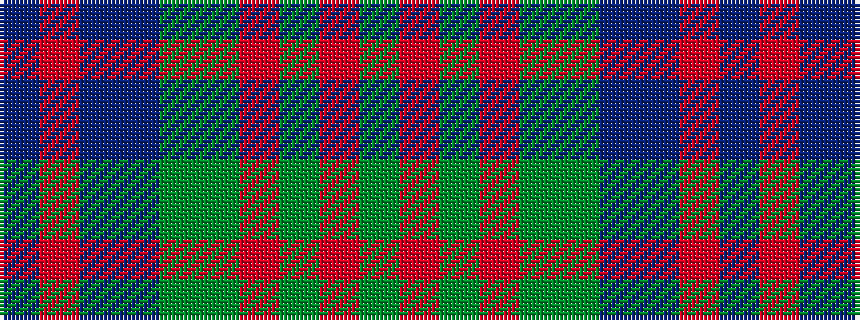

BRBBGGRGRG

It is a 10 stripe tartan.

<figure class="pat-woven">

<figcaption>idealised sample</figcaption>
</figure>

## Colour Sequence



## Tartans with this colour sequence

| Tartans |
|---------------|
| [Stewart of Appin Htg (Clan)](/variants/s10/g8r3g3r5g26dy7t3db28r3db6~x2/)|
||
| [Stewart of Appin Hunting Clan Tartan](/variants/s10/g11r4g4r7g41dy11t4db41r4db8/)|
||
