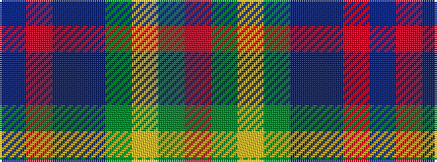

BRBBGYGR

It is a 8 stripe tartan.

<figure class="pat-woven">

<figcaption>idealised sample</figcaption>
</figure>

## Colour Sequence



## Tartans with this colour sequence

| Tartans |
|---------------|
| [Moray Council](/variants/s8/db8r2db33dt15g12lo2g2r2~x2/)|
||
