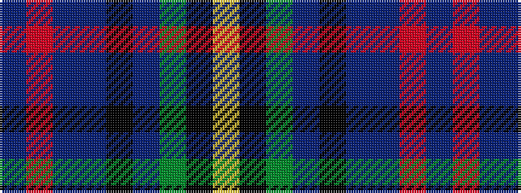

BRBBKBGKY

It is a 9 stripe tartan.

<figure class="pat-woven">

<figcaption>idealised sample</figcaption>
</figure>

## Colour Sequence



## Tartans with this colour sequence

| Tartans |
|---------------|
| [Incorporation of Weavers (Glasgow)](/setts/s9/db3o3db36db7k3db6g5k1ly3~x2/)|
||
