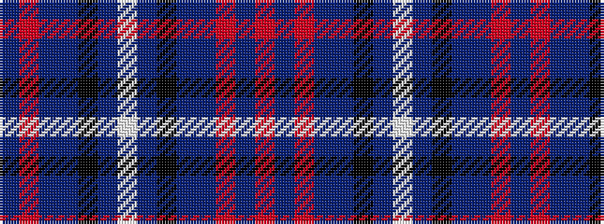

BRBBKBWBKBBRBR

It is a 14 stripe tartan.

<figure class="pat-woven">

<figcaption>idealised sample</figcaption>
</figure>

## Colour Sequence



## Tartans with this colour sequence

| Tartans |
|---------------|
| [Gretna Gold Fashion Tartan](/variants/s14/w3dp2k2dp38db28m2db2r2~x2/)|
||
