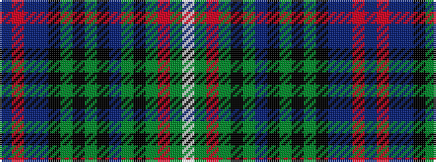

BRBBKGKGKBGKGRGW

It is a 16 stripe tartan.

<figure class="pat-woven">

<figcaption>idealised sample</figcaption>
</figure>

## Colour Sequence



## Tartans with this colour sequence

| Tartans |
|---------------|
| [Annandale (Personal)](/setts/s16/db3r2t2db16k2g2k2g2k2db16g2k10g4r4g12w3~x2/)|
||
