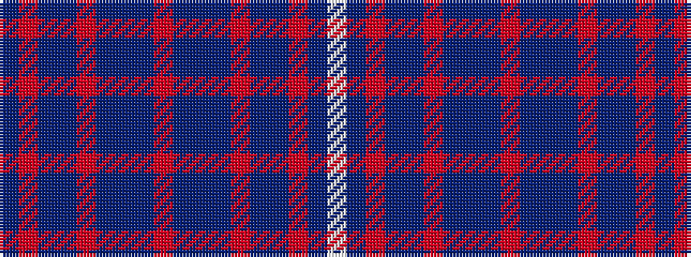

BRBBRBBBRBBBRBBRBW

It is a 18 stripe tartan.

<figure class="pat-woven">

<figcaption>idealised sample</figcaption>
</figure>

## Colour Sequence



## Tartans with this colour sequence

| Tartans |
|---------------|
| [Scottish North American Business Council](/setts/s18/db2r2dt6db4r2db2dt6db6r2db6dt6db2r2db4dt6r2db2w1~x4/)|
||
