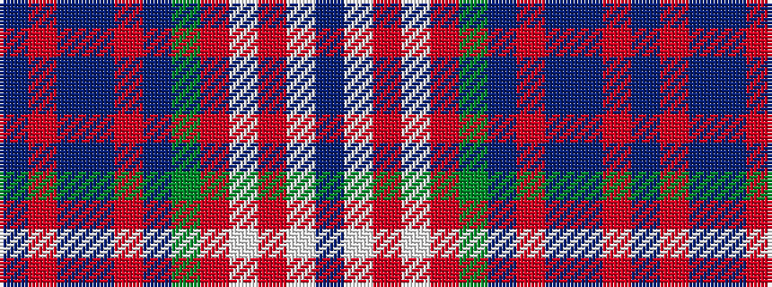

BRBBRBGRWRWB

It is a 12 stripe tartan.

<figure class="pat-woven">

<figcaption>idealised sample</figcaption>
</figure>

## Colour Sequence



## Tartans with this colour sequence

| Tartans |
|---------------|
| [Lashbrooke of Barrowfield (Personal)](/variants/s12/db3o2b12db14r2db4dy6o4w24r2w2db3~x2/)|
||
