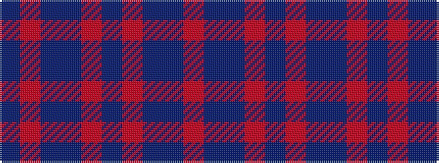

BRBBRBRBBR

It is a 10 stripe tartan.

<figure class="pat-woven">

<figcaption>idealised sample</figcaption>
</figure>

## Colour Sequence



## Tartans with this colour sequence

| Tartans |
|---------------|
| [Hutchesons' Grammar School](/setts/s10/t8o4db30dt30r3dt4~x2/)|
||
