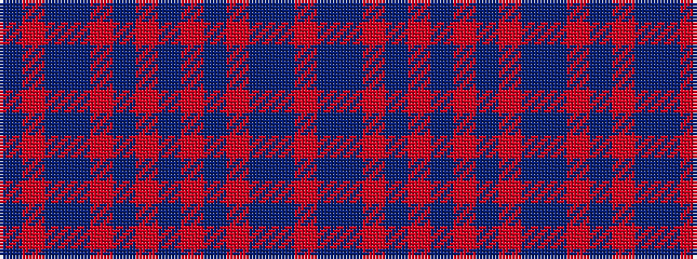

BRBBRBRBRBRBBR

It is a 14 stripe tartan.

<figure class="pat-woven">

<figcaption>idealised sample</figcaption>
</figure>

## Colour Sequence



## Tartans with this colour sequence

| Tartans |
|---------------|
| [Orkney Heather](/variants/s14/dp4m2dp2dpi4m2dp8m2n2o43n2o43dpi2dp8o2/)|
||
