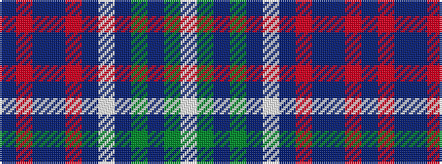

BRBBRBWBGBGW

It is a 12 stripe tartan.

<figure class="pat-woven">

<figcaption>idealised sample</figcaption>
</figure>

## Colour Sequence



## Tartans with this colour sequence

| Tartans |
|---------------|
| [Plymouth/Armada 400, Armada](/setts/s12/db40r2db7db5o2db3w2db10y6db2y4w2~x2/)|
||
