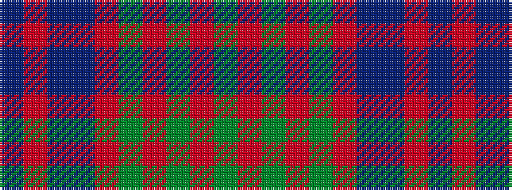

BRBBRGRGRG

It is a 10 stripe tartan.

<figure class="pat-woven">

<figcaption>idealised sample</figcaption>
</figure>

## Colour Sequence



## Tartans with this colour sequence

| Tartans |
|---------------|
| [Stewart of Appin, Ancient hunting](/setts/s10/g11r4g4r7g41o11t4db41r4db8/)|
||
