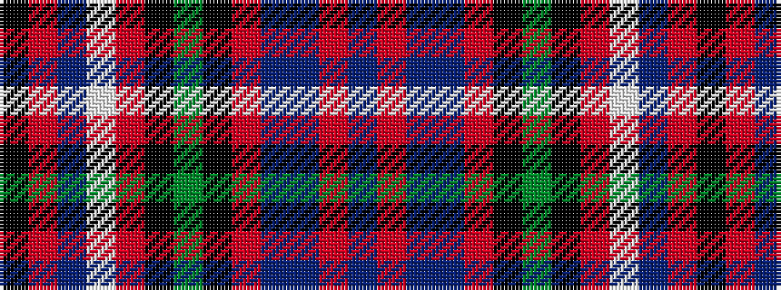

BRBBRKGKRWBRK

It is a 13 stripe tartan.

<figure class="pat-woven">

<figcaption>idealised sample</figcaption>
</figure>

## Colour Sequence



## Tartans with this colour sequence

| Tartans |
|---------------|
| [Giants Causeway (District)](/setts/s13/n19o4b2n10o22k1g3k1o3w1b5o1k3~x2/)|
||
