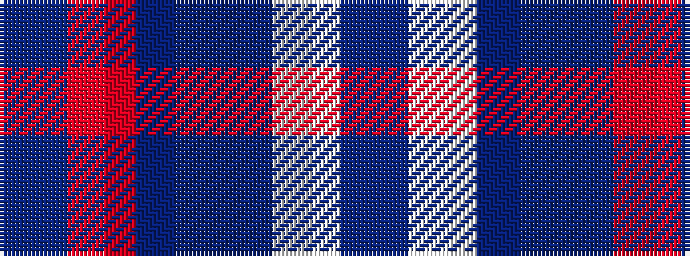

BRBBWB

It is a 6 stripe tartan.

<figure class="pat-woven">

<figcaption>idealised sample</figcaption>
</figure>

## Colour Sequence



## Tartans with this colour sequence

| Tartans |
|---------------|
| [Ewell Castle School](/setts/s6/dt4r1dt18dt18w1dt4~x4/)|
||
| [Ewell Castle School](/setts/s6/db4r1db18b18w1b4~x4/)|
||
