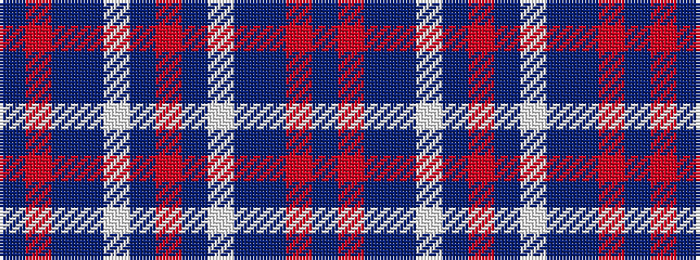

BRBBWBRBWBBRB

It is a 13 stripe tartan.

<figure class="pat-woven">

<figcaption>idealised sample</figcaption>
</figure>

## Colour Sequence



## Tartans with this colour sequence

| Tartans |
|---------------|
| [Illinois St Andrews Society Corporate Tartan Tartan Number: 2051. Earliest known date: 1991 A philanthropic society founded by Scots around 1840. The tartan was designed to mark the 150th anniversary. The colours represent the State of Illinois Flag, the Chicago sports teams and the St Andrew's flag. See products available Copyright © Blair Urquhart, Comrie, 2015](/setts/s13/db4r3t23db16w5t3r2t3w5t11db2r1db4~x2/)|
||
| [Illinois, St Andrews Society](/setts/s13/db4r3b23db16w5b3r2b3w5b11db2r1db4~x2/)|
||
