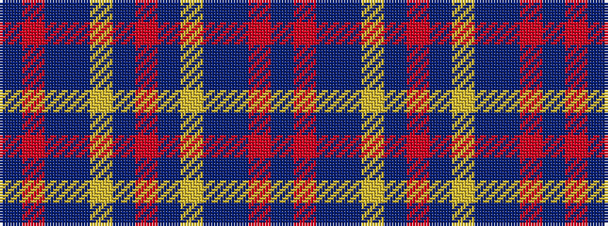

BRBBYBRBYBBRB

It is a 13 stripe tartan.

<figure class="pat-woven">

<figcaption>idealised sample</figcaption>
</figure>

## Colour Sequence



## Tartans with this colour sequence

| Tartans |
|---------------|
| [Illinois State (District)](/variants/s13/db6r3t24db12lr6t6r2t6lr6t12db2r2db6~x2/)|
||
