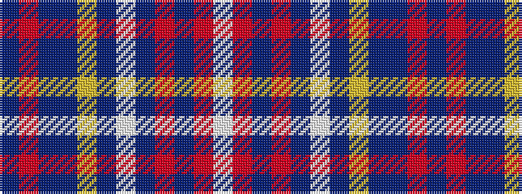

BRBBYBWBRBRW

It is a 12 stripe tartan.

<figure class="pat-woven">

<figcaption>idealised sample</figcaption>
</figure>

## Colour Sequence



## Tartans with this colour sequence

| Tartans |
|---------------|
| [Lady Diana, Plaid](/variants/s12/db46r3db7dr2ly2dr2w2dr11o6db2o3w2~x2/)|
||
