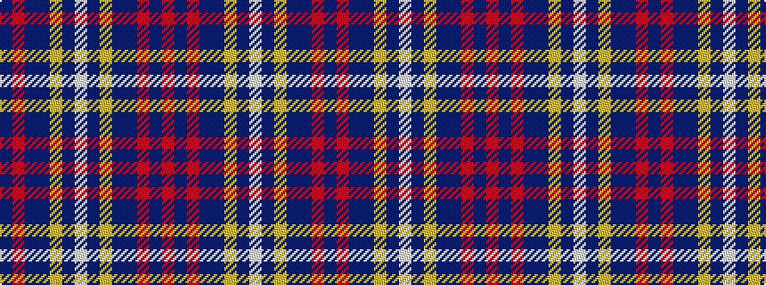

BRBBYBWBYBBRBR

It is a 14 stripe tartan.

<figure class="pat-woven">

<figcaption>idealised sample</figcaption>
</figure>

## Colour Sequence



## Tartans with this colour sequence

| Tartans |
|---------------|
| [Gretna Gold](/variants/s14/w3dp2lo2dp38db28m2db2r2~x2/)|
||
