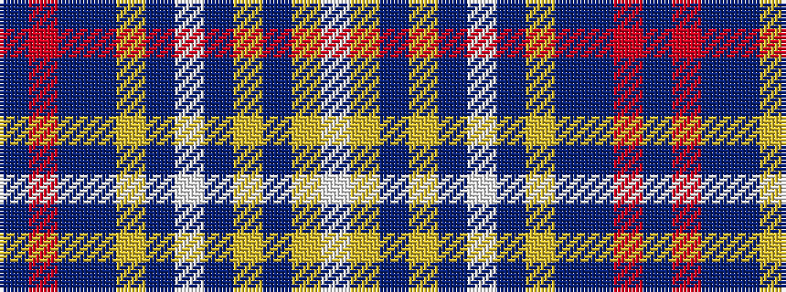

BRBBYBWBYBYW

It is a 12 stripe tartan.

<figure class="pat-woven">

<figcaption>idealised sample</figcaption>
</figure>

## Colour Sequence



## Tartans with this colour sequence

| Tartans |
|---------------|
| [Lady Diana Plaid Trade or Fancy Tartan Tartan Number: 484. Earliest known date: 1982 A confusing situation surrounds these 'Diana' tartans in that amost all of them are different colourways of the same basic sett shown here which is thought to have been designed in 1981 by Flairtex of Darvel in Ayrshire. Other Diana entries suggest that designers are West Coast Woolen Mills and/or Pringles. This sett and all others were entirely unofficial. Under the name of 'Princess Diana' Sindex notes have "Sindex notes say "Reputed to have been designed by M E MacDoanld and presented in form of silk shawl to Princess Diana in 1981." but it is not known to which design they're referring. A Companies House search for Flairtex in 2004 came up with nothing so as surmised, they are long gone. See products available Copyright © Blair Urquhart, Comrie, 2015](/setts/s12/db46r3db7do2ly2do2w2do11lo6db2lo3w2~x2/)|
|![Lady Diana Plaid Trade or Fancy Tartan Tartan Number: 484. Earliest known date: 1982 A confusing situation surrounds these 'Diana' tartans in that amost all of them are different colourways of the same basic sett shown here which is thought to have been designed in 1981 by Flairtex of Darvel in Ayrshire. Other Diana entries suggest that designers are West Coast Woolen Mills and/or Pringles. This sett and all others were entirely unofficial. Under the name of 'Princess Diana' Sindex notes have "Sindex notes say "Reputed to have been designed by M E MacDoanld and presented in form of silk shawl to Princess Diana in 1981." but it is not known to which design they're referring. A Companies House search for Flairtex in 2004 came up with nothing so as surmised, they are long gone. See products available Copyright © Blair Urquhart, Comrie, 2015 example sett](/setts/s12/db46r3db7do2ly2do2w2do11lo6db2lo3w2~x2/sett.png)|
