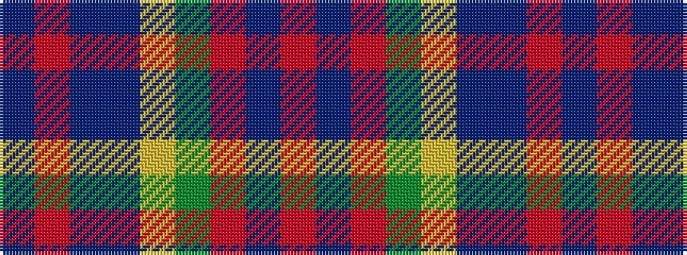

BRBBYGRBR

It is a 9 stripe tartan.

<figure class="pat-woven">

<figcaption>idealised sample</figcaption>
</figure>

## Colour Sequence



## Tartans with this colour sequence

| Tartans |
|---------------|
| [Caledonia No 3](/setts/s9/r13t3r13dg12ly2dp9t9r13dp2~x2/)|
||
| [Caledonia No 3](/setts/s9/r13t3r13g12ly2dp9t9r13dp2~x2/)|
||
