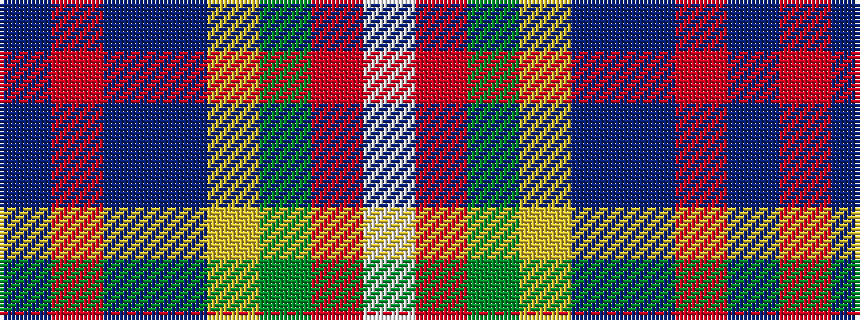

BRBBYGRW

It is a 8 stripe tartan.

<figure class="pat-woven">

<figcaption>idealised sample</figcaption>
</figure>

## Colour Sequence



## Tartans with this colour sequence

| Tartans |
|---------------|
| [Wilson's, No 2](/setts/s8/dp2r11t9dp11ly2g13r21w2~x2/)|
||
