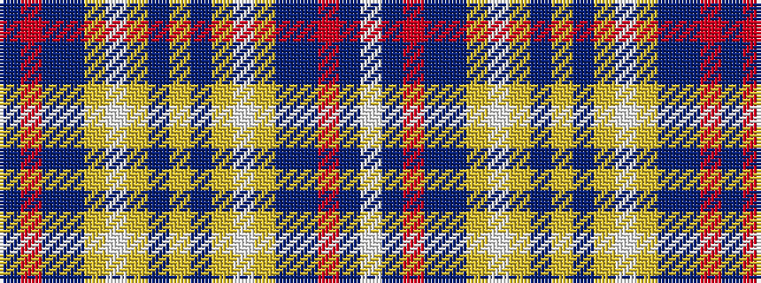

BRBBYWYBYBYWYBBRBW

It is a 18 stripe tartan.

<figure class="pat-woven">

<figcaption>idealised sample</figcaption>
</figure>

## Colour Sequence



## Tartans with this colour sequence

| Tartans |
|---------------|
| [Gray, Hamilton John](/variants/s18/dt6r3dt10n14lo6w18lo6n4lo2n4lo6w18lo6n14dt10r3dt6w4~x2/)|
||
