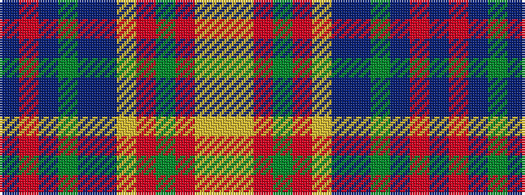

BRBGBBYRGRYY

It is a 12 stripe tartan.

<figure class="pat-woven">

<figcaption>idealised sample</figcaption>
</figure>

## Colour Sequence



## Tartans with this colour sequence

| Tartans |
|---------------|
| [Rainbow Kilt (Fashion)](/variants/s12/ly12lo12o12g2r2ly2dp12db12g12dp2r2db1~x2/)|
||
