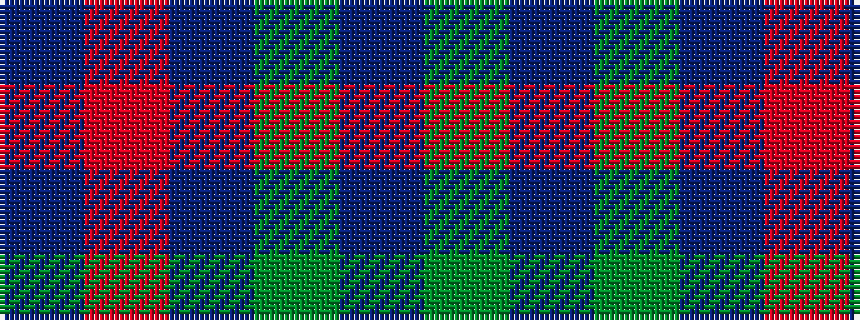

BRBGBG

It is a 6 stripe tartan.

<figure class="pat-woven">

<figcaption>idealised sample</figcaption>
</figure>

## Colour Sequence



## Tartans with this colour sequence

| Tartans |
|---------------|
| [MacNab (Macgregor - Hastie)](/variants/s6/dg3dp3dg19dp18r19dp3~x2/)|
||
| [MacNab 1](/variants/s6/dp3r19dp18g19dp3g3~x2/)|
||
| [Palm Beach Gardens Police](/variants/s6/g32t6g12t28r2db1~x2/)|
||
