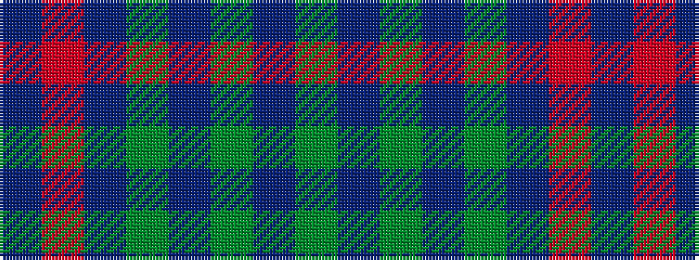

BRBGBGBG

It is a 8 stripe tartan.

<figure class="pat-woven">

<figcaption>idealised sample</figcaption>
</figure>

## Colour Sequence



## Tartans with this colour sequence

| Tartans |
|---------------|
| [Wcwm 1530](/variants/s8/dg36db3dg3db3dg6n34r4n4~x2/)|
||
