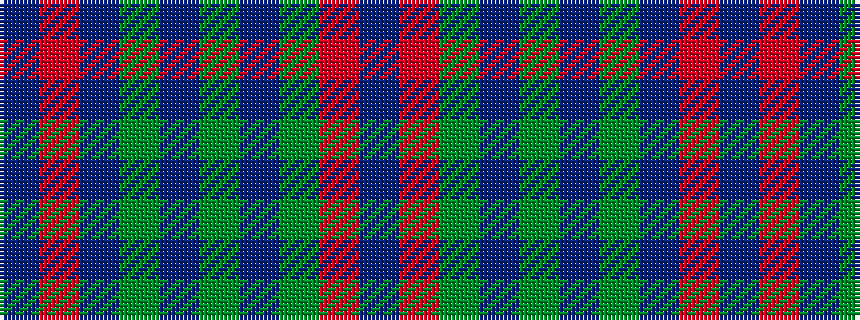

BRBGBGBGRB

It is a 10 stripe tartan.

<figure class="pat-woven">

<figcaption>idealised sample</figcaption>
</figure>

## Colour Sequence



## Tartans with this colour sequence

| Tartans |
|---------------|
| [Gray Family Tartan](/variants/s10/dr3o30g8dr2g2dr2g2dr8o7dr2~x2/)|
||
