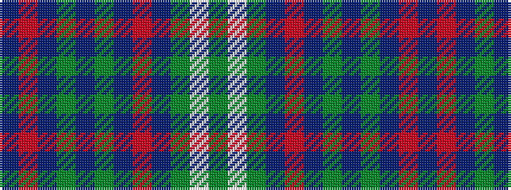

BRBGBGBRBGWG

It is a 12 stripe tartan.

<figure class="pat-woven">

<figcaption>idealised sample</figcaption>
</figure>

## Colour Sequence



## Tartans with this colour sequence

| Tartans |
|---------------|
| [Love Htg (Personal)](/setts/s12/dg32w3dg32db32r3db32dg32dp3dg32db32r3db32~x2/)|
||
