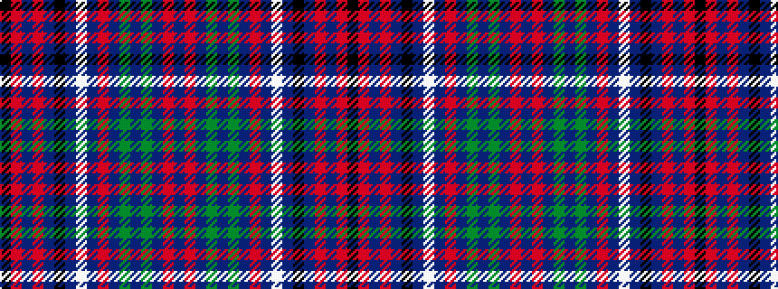

BRBGBGBRBWBKBRBRK

It is a 17 stripe tartan.

<figure class="pat-woven">

<figcaption>idealised sample</figcaption>
</figure>

## Colour Sequence



## Tartans with this colour sequence

| Tartans |
|---------------|
| [Isla Grant (Personal)](/variants/s17/k4r2db3r3db5k3db3w3db3r4db3dg3db3dg11db3r3db4~x2/)|
||
