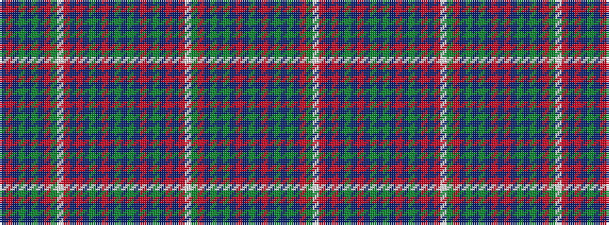

BRBGBGBRGWRBRBGBRBGBGBRBGBRBRWGRBGBGBRBG

It is a 40 stripe tartan.

<figure class="pat-woven">

<figcaption>idealised sample</figcaption>
</figure>

## Colour Sequence



## Tartans with this colour sequence

| Tartans |
|---------------|
| [Otago Peninsula](/setts/s40/g4dt4r4dt2g12dt2g12dt2r4g4w1ri4db2r4dt4g4dt4r4dt2g12dt2~x2/)|
||
