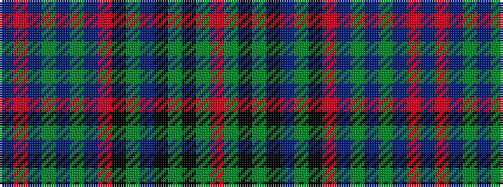

BRBGBGBRKGBKGKGR

It is a 16 stripe tartan.

<figure class="pat-woven">

<figcaption>idealised sample</figcaption>
</figure>

## Colour Sequence



## Tartans with this colour sequence

| Tartans |
|---------------|
| [Munster](/variants/s16/t4r2t3g1t1g2t18r1k12gi21t1k3gi1k2gi4r2~x2/)|
||
