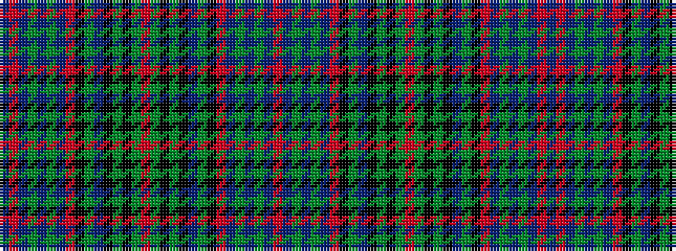

BRBGBGBRKGBKGKGRGKGKBGKRBGBGBR

It is a 30 stripe tartan.

<figure class="pat-woven">

<figcaption>idealised sample</figcaption>
</figure>

## Colour Sequence



## Tartans with this colour sequence

| Tartans |
|---------------|
| [Munster Irish District Tartan](/variants/s30/n4r2n3g1n1g2n18r1k12gi21n1k3gi1k2gi4r2~x2/)|
||
