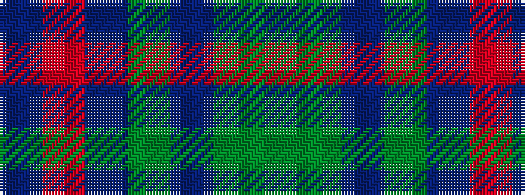

BRBGBGG

It is a 7 stripe tartan.

<figure class="pat-woven">

<figcaption>idealised sample</figcaption>
</figure>

## Colour Sequence



## Tartans with this colour sequence

| Tartans |
|---------------|
| [Myres Castle](/setts/s7/dgi3dg12dt6dgii3db15o2db2~x2/)|
||
