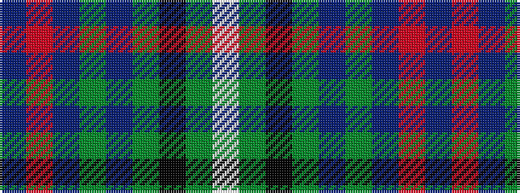

BRBGBGKGW

It is a 9 stripe tartan.

<figure class="pat-woven">

<figcaption>idealised sample</figcaption>
</figure>

## Colour Sequence



## Tartans with this colour sequence

| Tartans |
|---------------|
| [MacNeill](/setts/s9/p6r1p20g6p6g24k1g2w4~x2/)|
||
