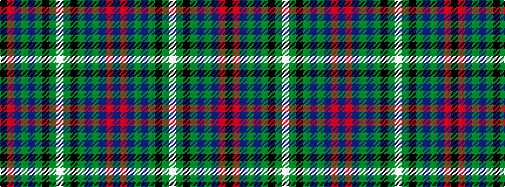

BRBGBGKGWGKGBGBRK

It is a 17 stripe tartan.

<figure class="pat-woven">

<figcaption>idealised sample</figcaption>
</figure>

## Colour Sequence



## Tartans with this colour sequence

| Tartans |
|---------------|
| [Blairlogie (District)](/variants/s17/k28r2n9g2n4g20k1g1w2g1k1g20n4g2n9r1n3~x2/)|
||
| [Blairlogie or Blair Athol](/variants/s17/k28r1db8g2db4g19k2g1w2g1k1g19db4g2db8r2db3~x4/)|
||
| [Blairlogie, or Blair Athol](/variants/s17/k20r3db10g3db5g25k1g1w3g1k1g25db5g3db10r1db2~x2/)|
||
