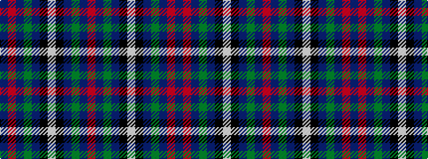

BRBGBKWKBGBR

It is a 12 stripe tartan.

<figure class="pat-woven">

<figcaption>idealised sample</figcaption>
</figure>

## Colour Sequence



## Tartans with this colour sequence

| Tartans |
|---------------|
| [Grainger](/variants/s12/db36r4db6g18db15k18w4~x2/)|
||
