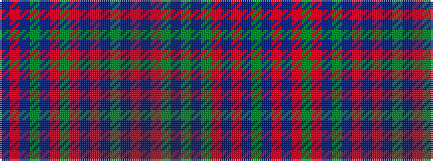

BRBGBRGRBRBGBRBRGBG

It is a 19 stripe tartan.

<figure class="pat-woven">

<figcaption>idealised sample</figcaption>
</figure>

## Colour Sequence



## Tartans with this colour sequence

| Tartans |
|---------------|
| [Jorgensen of Taasinge Family Tartan](/variants/s19/g2dt5g3r2dt11r2dt11dg18dt11r2dt11r2g3r11dt3dg5dt3r5b2~x2/)|
||
