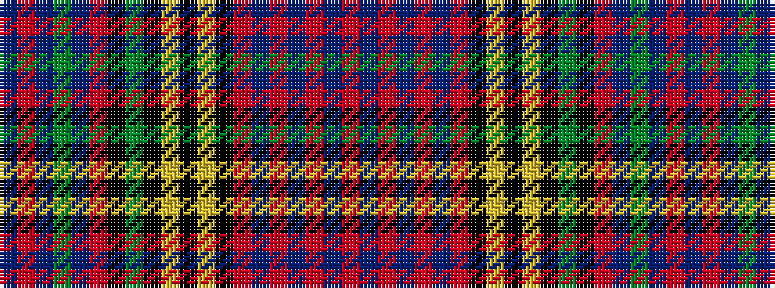

BRBGBRKGKYKYKRBRBRBR

It is a 20 stripe tartan.

<figure class="pat-woven">

<figcaption>idealised sample</figcaption>
</figure>

## Colour Sequence



## Tartans with this colour sequence

| Tartans |
|---------------|
| [Anderson of Kinnedear Red](/variants/s20/r4db6r2db2r4db6r3k4lo2k2lo2k4g2k4r22db1g2db1r6db3~x2/)|
||
