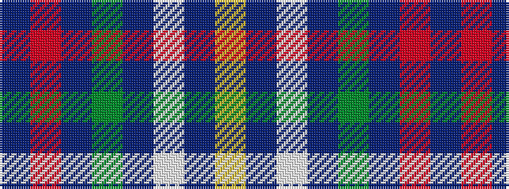

BRBGBWBY

It is a 8 stripe tartan.

<figure class="pat-woven">

<figcaption>idealised sample</figcaption>
</figure>

## Colour Sequence



## Tartans with this colour sequence

| Tartans |
|---------------|
| [Columba of Iona (School)](/setts/s8/db14m3db14dy6db14w4db14ly3~x2/)|
||
