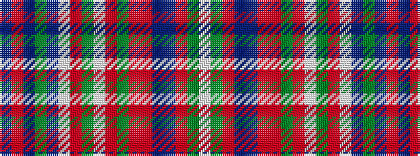

BRBGBWRGWRGRRBBRGW

It is a 18 stripe tartan.

<figure class="pat-woven">

<figcaption>idealised sample</figcaption>
</figure>

## Colour Sequence



## Tartans with this colour sequence

| Tartans |
|---------------|
| [Welly (Personal)](/setts/s18/n1mi1n1g1n1w1mi1g1w1mi1g1m1mi1n1ni1mi1g1w1~x10/)|
||
