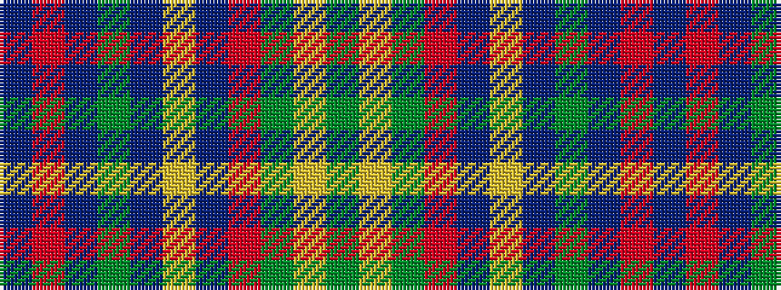

BRBGBYBRGYG

It is a 11 stripe tartan.

<figure class="pat-woven">

<figcaption>idealised sample</figcaption>
</figure>

## Colour Sequence



## Tartans with this colour sequence

| Tartans |
|---------------|
| [Mariverain](/variants/s11/db5r1db5g7db3lo1db4r5g2lo2g2~x8/)|
||
