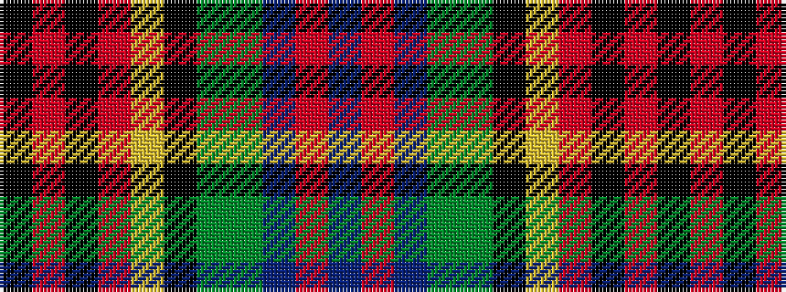

BRBGGKYRKRK

It is a 11 stripe tartan.

<figure class="pat-woven">

<figcaption>idealised sample</figcaption>
</figure>

## Colour Sequence



## Tartans with this colour sequence

| Tartans |
|---------------|
| [Blake (Personal)](/variants/s11/k4r1k3r2lo3k12dg10dgi18db3o3db3~x2/)|
||
| [Blake, William & Agnes (Australia)](/variants/s11/k4r1k3r2ly3k12dg10dgi18db3o3db3~x2/)|
||
