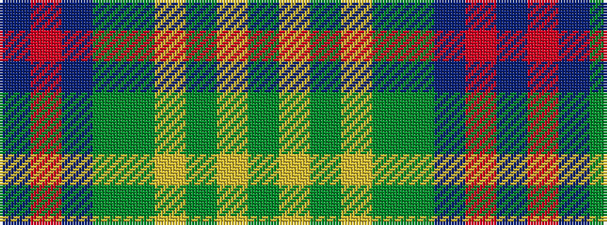

BRBGGYGYG

It is a 9 stripe tartan.

<figure class="pat-woven">

<figcaption>idealised sample</figcaption>
</figure>

## Colour Sequence



## Tartans with this colour sequence

| Tartans |
|---------------|
| [Keith Stanhope Society (Commem.)](/setts/s9/dt40r4dt10g10y22lo3y4ly3y4~x2/)|
||
