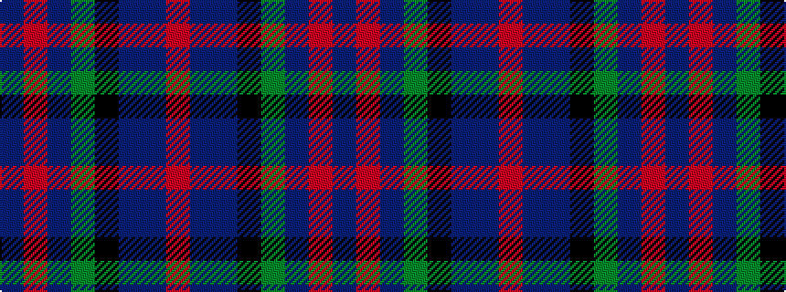

BRBGKBBR

It is a 8 stripe tartan.

<figure class="pat-woven">

<figcaption>idealised sample</figcaption>
</figure>

## Colour Sequence



## Tartans with this colour sequence

| Tartans |
|---------------|
| [MacDuff Hunting](/variants/s8/do10r2do10g17k12db9do9r2~x2/)|
||
| [Wcwm 1310](/variants/s8/do10r3do10g14k12db12do14r4~x2/)|
||
