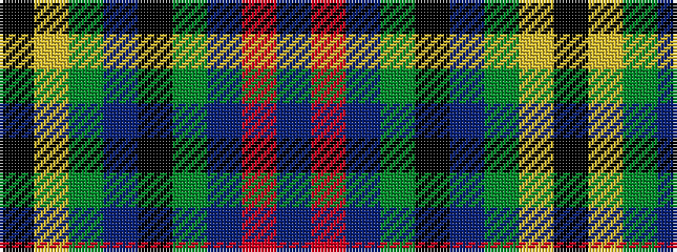

BRBGKBGYK

It is a 9 stripe tartan.

<figure class="pat-woven">

<figcaption>idealised sample</figcaption>
</figure>

## Colour Sequence



## Tartans with this colour sequence

| Tartans |
|---------------|
| [Maresh](/variants/s9/k3ly3g22db6k17g6db22r3db3~x2/)|
||
