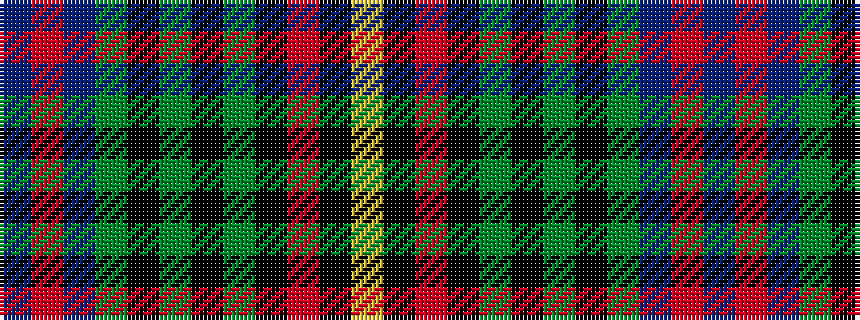

BRBGKGKGKRKY

It is a 12 stripe tartan.

<figure class="pat-woven">

<figcaption>idealised sample</figcaption>
</figure>

## Colour Sequence



## Tartans with this colour sequence

| Tartans |
|---------------|
| [Scottish Spirit Fashion Tartan](/variants/s12/n10r3n32y12k5y2k4y2k17o4k2lr2~x2/)|
||
