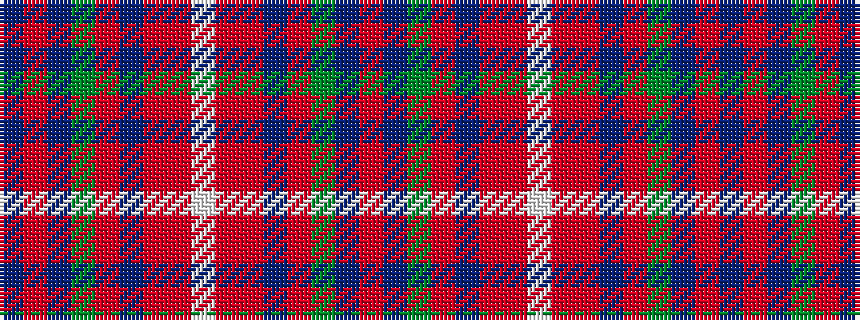

BRBGRBRRWRRBRGBR

It is a 16 stripe tartan.

<figure class="pat-woven">

<figcaption>idealised sample</figcaption>
</figure>

## Colour Sequence



## Tartans with this colour sequence

| Tartans |
|---------------|
| [Kansai2](/setts/s16/t2r1t8g7ri1b6o1r1w1~x4/)|
||
