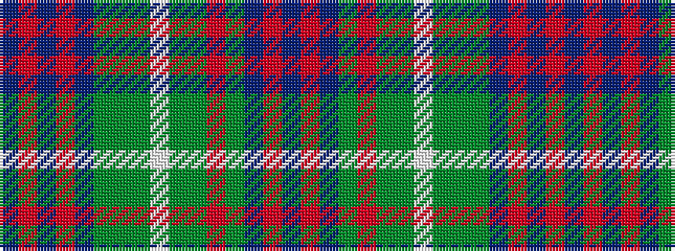

BRBGRGGWGGGBRBRB

It is a 16 stripe tartan.

<figure class="pat-woven">

<figcaption>idealised sample</figcaption>
</figure>

## Colour Sequence



## Tartans with this colour sequence

| Tartans |
|---------------|
| [Forbes, of Druminnor](/setts/s16/db6o2db2o2db2dy6g8dy1w2dy1g8o2dy4db8o2db2~x2/)|
||
