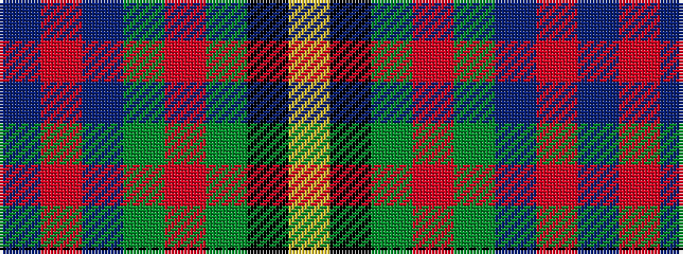

BRBGRGKY

It is a 8 stripe tartan.

<figure class="pat-woven">

<figcaption>idealised sample</figcaption>
</figure>

## Colour Sequence



## Tartans with this colour sequence

| Tartans |
|---------------|
| [Craik of Assington (Personal)](/setts/s8/db4r11db1g8r2g4k1lo2~x4/)|
||
| [Craik, of Assington](/setts/s8/db4r11db1g8r2g4k1ly2~x4/)|
||
