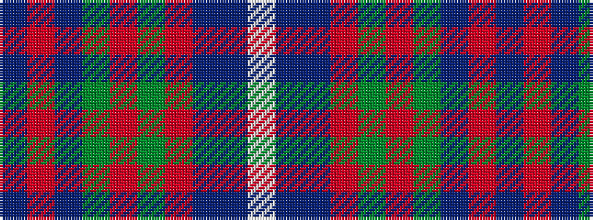

BRBGRGRBBW

It is a 10 stripe tartan.

<figure class="pat-woven">

<figcaption>idealised sample</figcaption>
</figure>

## Colour Sequence



## Tartans with this colour sequence

| Tartans |
|---------------|
| [Accenture](/variants/s10/dp3o1db4g2r2g21o3dp21db25w3~x2/)|
||
